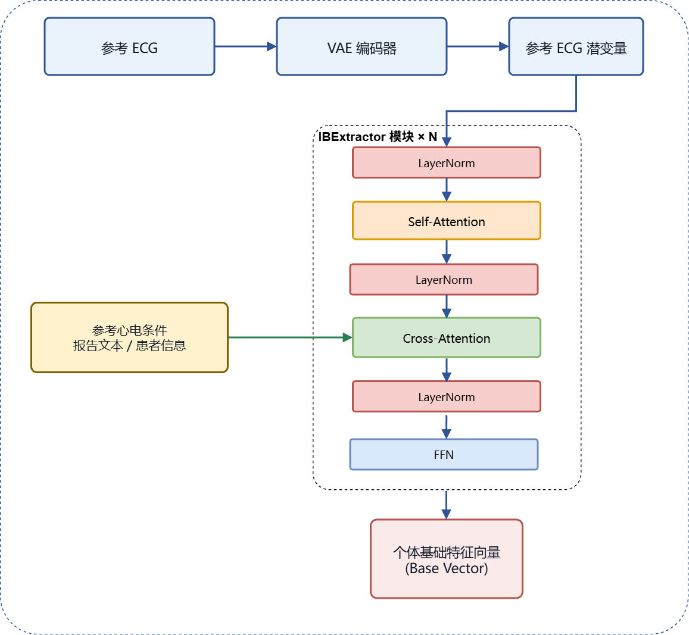
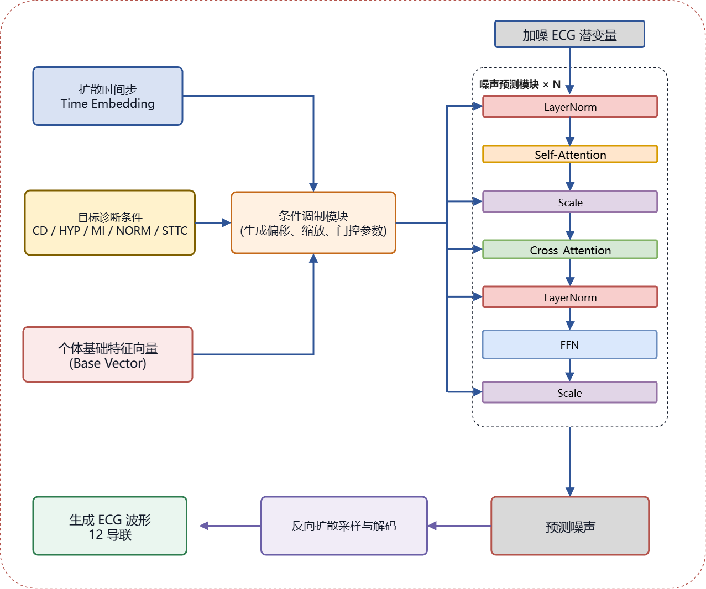
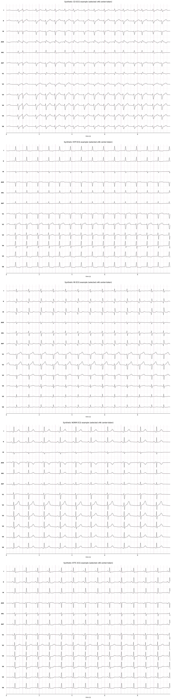
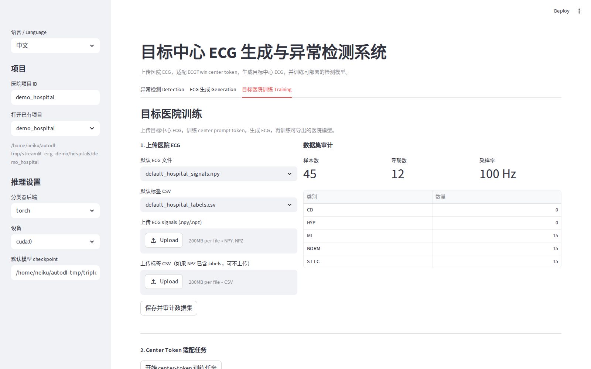
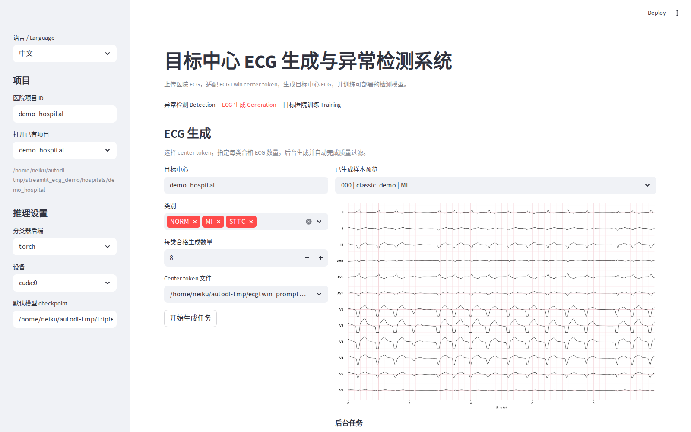
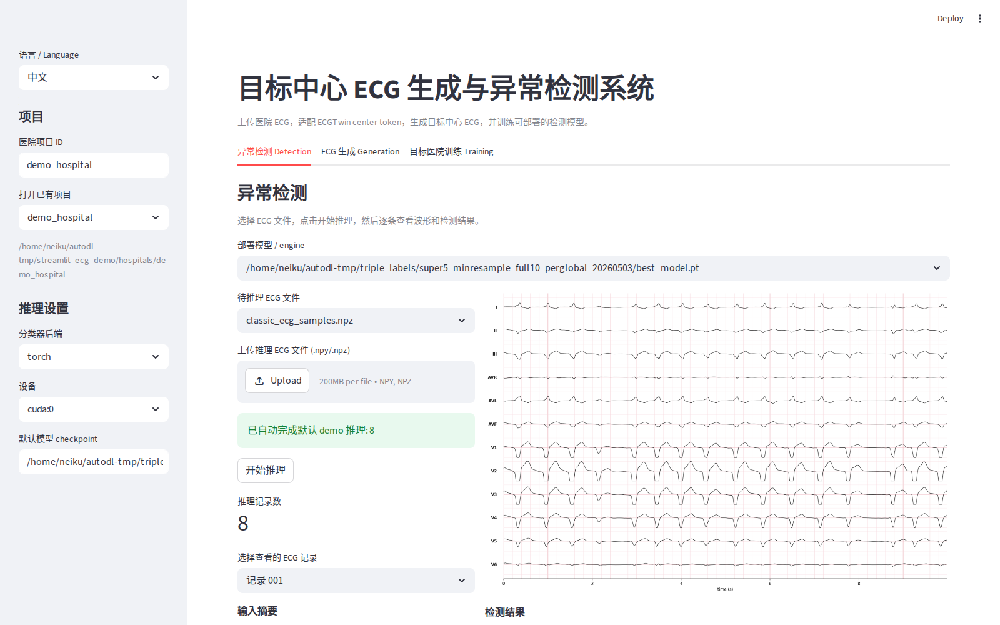
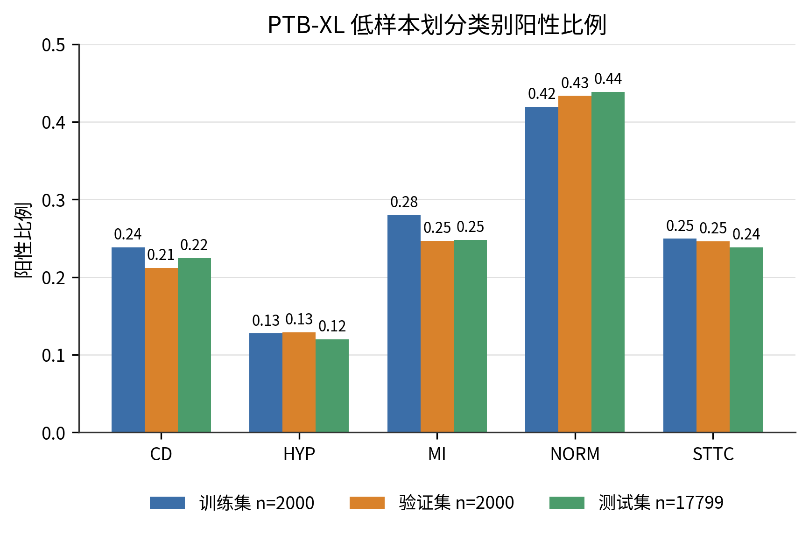
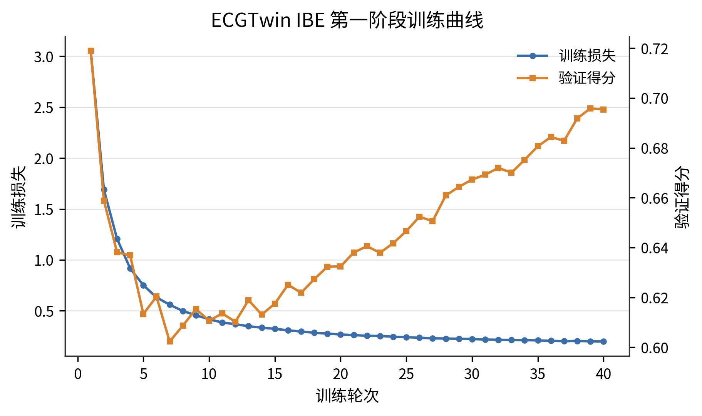
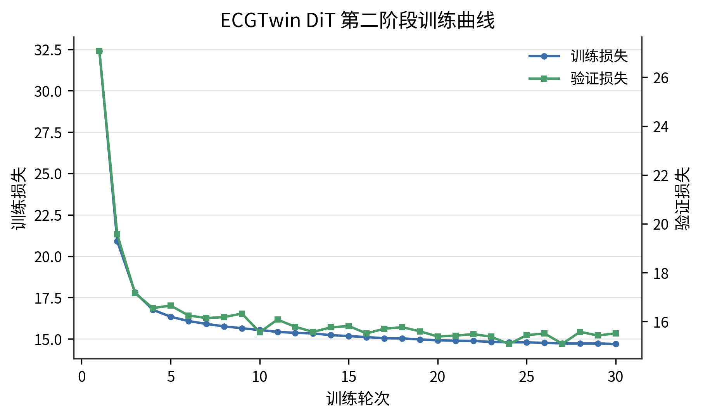
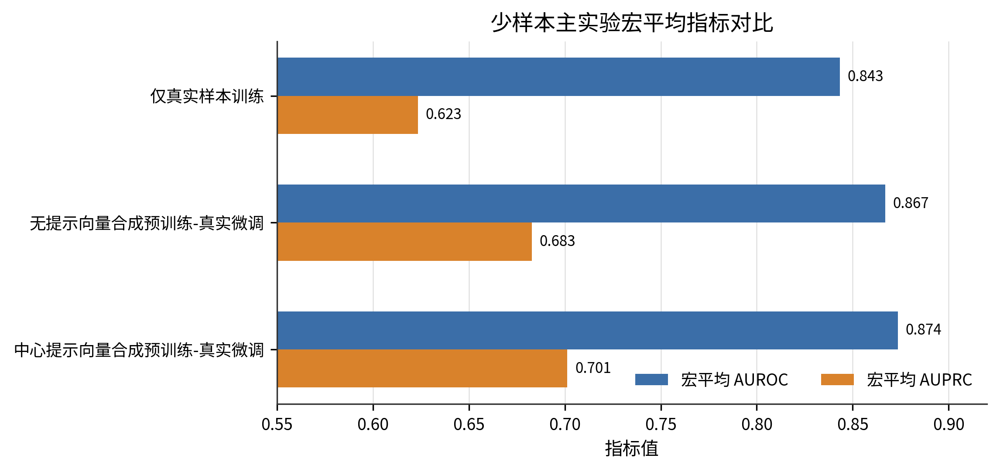

# 摘要

本课题针对心电图自动分析中真实医疗数据获取成本高、标注样本不足等问题，设计并实现一种基于潜在扩散模型的心电图数据生成与异常检测系统。系统以PTB-XL为主实验数据集，围绕ECG数据生成、少样本多标签异常检测训练和推理展示三个模块开展设计与实现。

在数据生成模块中，本文参考ECGTwin的潜在扩散生成框架，在潜空间中生成12导联合成ECG，并借鉴Textual Inversion（文本反演）思想学习中心提示向量，以增强目标诊断类别对生成过程的约束能力；同时结合数值质量检查、基础数字ECG特征和可视化结果对合成样本进行筛选。在异常检测模块中，本文采用一维EfficientNetV2构建PTB-XL诊断超类五标签异常检测模型，将扩散模型生成的合成数据用于辅助模型训练。实验结果表明，在固定2000条真实训练样本条件下，合成预训练-真实微调策略优于仅真实样本训练，测试集宏平均AUROC/AUPRC由0.8433/0.6234提升至0.8735/0.7013。

在推理部署模块中，本文面向物联网AI医疗中的边缘侧ECG快速分析场景，设计TensorRT与Streamlit结合的应用框架。系统以12导联ECG数据接入、边缘推理、异常概率输出和结果可视化为主要流程，使用TensorRT对训练后的检测模型进行FP16推理加速，以降低边缘侧单次推理延迟并提高批量筛查吞吐能力，从而形成覆盖心电图生成、异常检测训练、边缘推理部署与快速结果展示的系统实现流程。

**关键词：** 心电图；潜在扩散模型；EfficientNetV2；少样本学习；物联网边缘推理

# Abstract

This thesis addresses the high acquisition cost and limited labeled samples of electrocardiogram (ECG) data in intelligent ECG analysis. It designs and implements an ECG data generation and abnormality detection system based on a latent diffusion model. The system is organized around a fixed limited-sample multi-label protocol on the public PTB-XL dataset and includes data preprocessing, conditional ECG synthesis, abnormality detection training, and interactive edge inference deployment. Its purpose is to evaluate whether diffusion-generated 12-lead ECG samples can provide useful supplementary training information when only a small number of labeled real ECG records are available.

In the ECG generation module, this thesis follows a two-stage latent diffusion framework. A variational auto-encoder maps ECG signals into a compact latent space. An individual base extractor is used to obtain patient-related base representations from reference ECG conditions, and a diffusion transformer predicts noise in the latent space under diagnostic conditions. Inspired by Textual Inversion, a learnable center prompt vector is introduced to strengthen target-category conditioning without changing the original tokenizer. The generated samples are further screened with numerical validity checks, digital ECG feature analysis, lead-consistency inspection, semantic response evaluation, and waveform visualization, so that evidently unreasonable samples are excluded before being used for downstream training.

In the abnormality detection module, a one-dimensional EfficientNetV2 model is adapted for the PTB-XL diagnostic superclass five-label task. Synthetic ECG data are used for pretraining, and the model is then fine-tuned with real ECG samples. Under the fixed setting with 2,000 real training records, the synthetic pretraining followed by real-data fine-tuning strategy improves the test macro AUROC/AUPRC from 0.8433/0.6234 to 0.8735/0.7013. For system implementation, TensorRT is used to accelerate model inference in an IoT healthcare edge-computing scenario, and Streamlit is used to build an interactive prototype for ECG upload, waveform display, abnormality prediction, confidence visualization, generated-sample preview, and training-process management. The TensorRT FP16 backend reduces single-sample inference latency and supports high-throughput batch screening, while the interface presents the edge-side ECG analysis process. The results show that the proposed system forms a complete workflow covering ECG generation, abnormality detection training, experimental evaluation, and IoT-oriented edge inference demonstration.

**Key words:** electrocardiogram; latent diffusion model; EfficientNetV2; limited-sample learning; IoT edge inference

# 1 绪论

本章围绕心电图智能分析、医学时序数据生成和少样本异常检测展开，首先说明课题背景和研究意义，随后梳理ECG自动诊断、可控扩散生成和合成数据增强相关工作，最后给出本文的任务划分与技术路线。

## 1.1 研究背景及意义

心血管疾病严重影响居民健康，早期筛查和及时干预有助于降低疾病风险。心电图（Electrocardiogram，ECG）能够以低成本、无创的方式记录心脏电活动，是临床筛查心律失常、心肌梗死、传导异常、心肌肥厚以及ST-T改变等心脏异常的常用检查手段。12导联心电图从多个空间方向反映心脏电活动，相比单导联信号包含更丰富的诊断信息，但其形态复杂、类别共现普遍，人工判读需要依赖较强的专业经验。因此，利用深度学习模型辅助心电图自动分析，已经成为医学人工智能研究中的重要方向。

近年来，卷积神经网络、循环神经网络、Transformer以及大规模预训练模型被逐步应用于心电图自动诊断任务。相关研究表明，深度神经网络能够从原始心电信号中学习有效特征，并在多种心电异常检测任务中取得较高性能[@hannunCardiologistLevelArrhythmia2019; @ribeiroAutomaticDiagnosis12Lead2020]。以PTB-XL为代表的公开12导联心电图数据集[@wagnerPTBXLLargePublicly2020]，也为心电图深度学习算法的统一评测提供了基础数据条件。不过，医学数据仍然具有获取成本高、标注成本高、隐私约束强和类别分布不均衡等特点。在真实场景中，部分类别样本数量有限，不同异常类别之间还可能存在共现关系，使得模型在少样本条件下容易出现泛化能力不足、少数类识别性能下降等问题。

针对上述问题，数据增强和合成数据生成逐渐成为提升医学人工智能模型训练效果的重要手段。传统数据增强通常通过裁剪、扰动、缩放、噪声注入等方式扩充训练样本，但这类方法对复杂医学时序信号的语义控制能力有限，难以稳定生成具有特定诊断含义的样本。生成式模型可以近似学习训练数据分布，并生成具有相似统计特征的新样本，为缓解数据不足、类别不均衡和隐私限制提供了新的思路。特别是扩散模型在图像、音频和医学数据生成任务中表现出较强的建模能力，潜在扩散模型通过在低维潜空间中完成生成过程，能够兼顾生成质量与计算开销[@hoDenoisingDiffusionProbabilistic2020; @rombachHighResolutionImageSynthesis2022]。

随着可穿戴设备、床旁监护设备和远程心电采集终端的发展，ECG分析逐渐从单一离线判读扩展到物联网医疗场景下的连续采集、边缘计算和远程辅助分析。此类场景要求异常检测模型不仅具备较好的识别性能，还需要在边缘侧具备较低推理延迟、稳定数据接入和直观结果展示能力。因此，将心电异常检测模型与边缘推理框架结合，是物联网工程专业背景下开展AI医疗系统设计的重要切入点。

本文关注生成模型在少样本ECG异常检测中的实际作用。本文以公开心电图数据为实验对象，围绕潜在扩散模型ECG生成、一维EfficientNetV2异常检测模型训练以及面向物联网医疗边缘计算的TensorRT与Streamlit推理展示框架开展研究，重点考察扩散模型合成数据对少样本心电异常检测的辅助效果。通过统一的数据划分、训练设置和评价指标，本文系统分析合成ECG在少样本异常检测中的作用，并验证训练后检测模型在边缘侧快速推理和交互展示中的工程可行性。

## 1.2 国内外研究现状

围绕本文研究目标，国内外相关工作主要集中在心电图自动诊断、医学时序数据生成、可控扩散生成和少样本合成增强四个方面。心电图自动诊断研究已经从人工特征工程逐步发展到深度学习端到端建模。早期方法通常依赖R峰、RR间期、QRS宽度和ST段等人工特征；深度学习方法则能够直接从原始ECG波形中学习局部形态、导联间关系和长程时序依赖。Hannun等构建了面向动态心电数据的深度神经网络，展示了深度模型在心律失常检测中的应用潜力[@hannunCardiologistLevelArrhythmia2019]；Ribeiro等研究了12导联ECG自动诊断任务，说明多导联信号与深度网络结合能够支持多类诊断预测[@ribeiroAutomaticDiagnosis12Lead2020]。PTB-XL数据集的发布为12导联ECG深度学习研究提供了公开基准[@wagnerPTBXLLargePublicly2020]，Strodthoff等进一步基于PTB-XL对多种模型进行了系统评测[@strodthoffDeepLearningECG2021]。从模型结构看，CNN仍适合捕捉ECG局部波形形态；EfficientNet与EfficientNetV2通过结构缩放和训练效率改进，为本文构建一维EfficientNetV2分类器提供了基础[@tanEfficientNetRethinking2019; @tanEfficientNetV2SmallerModels2021]。

医学时序数据生成技术为样本扩充和模型预训练提供了新的技术路径。VAE、GAN等生成模型能够学习数据分布并产生新样本[@kingmaAutoEncodingVariational2014; @goodfellowGenerativeAdversarialNets2014]，循环生成对抗网络也曾被用于多维医疗时间序列生成，并通过真实测试集上的下游任务评价合成数据价值[@estebanRealvaluedMedicalTime2017]。扩散模型通过逐步加噪和去噪学习数据分布，训练过程相对稳定[@hoDenoisingDiffusionProbabilistic2020]；DDIM提供了更高效的采样方式[@songDenoisingDiffusionImplicit2021]。在ECG生成方向，SSSD-ECG、DiffuSETS等工作说明扩散模型能够在诊断语句或临床文本条件下生成12导联ECG[@alcarazDiffusionbasedConditionalECG2023; @laiDiffuSETS12leadECG2025]。医学时序生成除波形外观外，还需要同时考虑导联关系、节律特征、诊断语义和下游模型表现。

可控扩散生成重点研究生成目标与条件约束之间的关系。潜在扩散模型将扩散过程放在压缩潜空间中，能够降低高维信号空间建模开销[@rombachHighResolutionImageSynthesis2022]；DiT将Transformer引入扩散噪声预测网络，为长序列全局建模提供了参考[@peeblesScalableDiffusionModels2023]。ECGTwin面向个性化ECG生成，通过VAE编码ECG潜变量，使用Individual Base Extractor提取参考样本中的个体基础特征向量，再由潜空间扩散模型结合诊断文本条件完成去噪生成[@laiECGTwinPersonalizedECG2026]。该框架为本文生成模块提供了参考ECG、诊断文本和潜在扩散生成相结合的基础。本文在此基础上复现IBE与DiT两阶段生成方法，并评估合成ECG对PTB-XL少样本异常检测的作用。

少样本学习关注在标注样本有限时提升模型泛化能力。对于ECG异常检测，少样本问题既来自医学数据获取和标注成本，也来自异常类别分布不均衡。传统增强方法能够增加样本多样性[@shortenSurveyImageData2019; @iwanaEmpiricalSurveyTimeSeries2021]，但ECG增强需要尽量保持疾病相关波形形态。近期合成ECG研究开始将生成样本用于数据扩充和真实数据微调，并指出合成分布与真实分布的差距会影响下游收益[@nunezSyntheticECGGeneration2024]。因此，本文采用PTB-XL诊断超类五标签少样本协议，以2000条真实ECG建立仅真实样本训练对照，比较真实-合成联合训练、仅合成样本训练、合成预训练-真实微调和不同生成条件对照。评价以真实测试集AUROC、AUPRC和分类别指标为准，同时结合合成波形展示和质量检查结果进行分析。

## 1.3 课题任务分析

根据课题目标，本文需要完成ECG数据生成、ECG异常检测以及推理部署与结果展示三部分任务。

第一，完成ECG数据生成流程。该流程以公开12导联ECG数据为基础，完成数据预处理、标签映射、少样本训练集划分和生成条件构建；在模型侧，围绕潜在扩散模型实现ECG合成流程，生成与目标诊断类别相关的合成ECG样本；在质量控制侧，对生成样本进行非法数值、近似平直波形、幅值范围、导联一致性和基础医学数字特征检查，为后续异常检测训练提供可筛选的合成样本池。

第二，完成PTB-XL五标签异常检测训练与评估。该任务以PTB-XL诊断超类五标签为主要实验对象，类别包括传导异常（CD）、心肌肥厚（HYP）、心肌梗死（MI）、正常心电（NORM）和ST-T改变（STTC）。检测模型采用一维EfficientNetV2结构，对多导联ECG信号进行异常识别，并在仅真实样本训练的基础上，引入扩散模型合成数据进行辅助训练。实验部分比较仅真实样本训练、真实-合成联合训练、仅合成样本训练和合成预训练-真实微调等策略的检测效果，分析合成数据对模型性能的影响。

第三，完成面向物联网医疗场景的边缘推理与结果展示原型。模型训练完成后，面向系统验证需求，设计TensorRT与Streamlit结合的推理框架。系统将ECG采集端或上传端视为数据输入侧，将部署检测模型的GPU或边缘计算节点视为推理侧。TensorRT负责对训练后的检测模型进行FP16推理优化，Streamlit负责提供ECG文件上传、波形可视化、异常检测结果显示和置信度展示界面。该原型将训练后的检测模型接入推理后端和交互界面，使课题从模型训练扩展到可运行的边缘推理应用，覆盖算法实验、推理优化和结果展示等系统实现环节。

除上述功能任务外，本文还需要保证实验过程具有可核查性。具体包括固定数据划分，统一训练设置、模型选择标准、评价指标和可视化分析方式，使生成、训练和测试环节具有一致的实验口径。

## 1.4 本文研究内容与技术路线

围绕上述课题任务，本文主要完成五项工作：其一，构建PTB-XL诊断超类五标签少样本实验协议，固定训练集、验证集和测试集划分；其二，参考ECGTwin构建潜在扩散ECG生成模块，并完成IBE与DiT两阶段生成方法复现；其三，设计合成ECG的质量门控与可视化流程，减少数值异常或语义不稳定样本进入训练；其四，基于一维EfficientNetV2构建异常检测模型，比较仅真实样本训练、真实-合成联合训练和合成预训练-真实微调等策略；其五，设计面向物联网AI医疗边缘推理的TensorRT与Streamlit展示框架，使训练后的检测模型能够进行快速推理、波形展示和异常概率反馈。

在数据准备阶段，本文读取PTB-XL公开ECG数据，完成导联顺序处理、采样长度统一、数值清理和诊断超类五标签映射，并构建固定少样本划分协议。在生成建模阶段，本文基于潜在扩散模型生成ECG样本，通过参考ECG、类别条件和潜空间去噪过程得到合成ECG，并对生成结果进行质量检查和可视化。在检测训练阶段，本文构建一维EfficientNetV2异常检测模型，先使用真实2000条ECG训练基线模型，再引入合成样本进行增强训练、预训练和微调对比。在推理展示阶段，本文设计TensorRT加速和Streamlit可视化框架，使原型系统支持ECG输入、边缘侧模型推理、波形展示、异常检测和结果输出。在实验评测阶段，本文使用固定测试集和多标签分类指标，对不同训练策略进行比较，并分析生成样本质量、分类性能和系统运行效果。

# 2 数据集与相关理论基础

本章介绍本文系统设计所需的数据集、模型和工程技术基础，重点说明12导联ECG表示、PTB-XL诊断超类五标签任务、潜在扩散生成框架、一维EfficientNetV2检测模型、合成数据训练策略以及推理部署技术。

## 2.1 心电图信号基础

心电图（Electrocardiogram, ECG）通过体表电极记录心脏兴奋传播过程中的电位变化，是心血管疾病筛查和诊断的重要依据。标准12导联ECG通常包括I、II、III、aVR、aVL、aVF以及V1-V6，各导联从不同空间方向观察心脏电活动。AHA/ACCF/HRS对ECG采集、滤波和解释流程给出了标准化建议[@kligfieldRecommendationsStandardizationInterpretation2007]。一个典型心动周期主要由P波、PR间期、QRS波群、ST段、T波和RR间期组成，其中QRS宽度、ST段偏移、T波形态和RR间期变化与传导异常、心肌梗死、ST-T改变等诊断类别密切相关。传统自动分析常依赖R峰检测和QRS定位，经典Pan-Tompkins算法[@panRealTimeQRSDetection1985] 即是该方向的代表方法之一。

在深度学习系统中，ECG通常表示为多通道时间序列。本文主实验将PTB-XL信号统一为100 Hz、10 s、1000点、12导联输入。由于生成模型和检测模型的数据来源不同，导联顺序和采样长度并不完全一致，因此生成结果进入分类器前需要进行导联重排、长度转换和尺度标准化。

标准12导联ECG由肢体导联和胸前导联共同构成，各导联之间具有明确的空间观测关系。I、II、III导联之间存在Einthoven关系，aVR、aVL、aVF也与肢体导联组合有关。因此，本文在评价合成ECG时同时观察单条导联的波形形态、导联间代数关系和异常幅值，以发现视觉上近似ECG但导联组合关系不合理的样本。

## 2.2 心电异常类别与PTB-XL诊断超类五标签任务

本文异常检测模块采用PTB-XL官方诊断标签中的五个诊断超类（diagnostic superclasses）：传导异常（Conduction Disturbance, CD）、心肌或心房心室肥厚（Hypertrophy, HYP）、心肌梗死（Myocardial Infarction, MI）、正常心电图（Normal ECG, NORM）和ST-T改变（ST/T Change, STTC）。该任务属于多标签任务，一条ECG可同时具有多个诊断超类，模型输出相应设置为五维二值概率。本文固定类别顺序为CD、HYP、MI、NORM、STTC，并根据PTB-XL的SCP诊断代码和官方诊断超类字段完成标签归并。该设置决定了模型训练采用二元交叉熵类损失，并以宏平均AUROC、AUPRC及分类别指标评价结果。

PTB-XL的诊断标签由更细粒度的SCP诊断代码组成，官方诊断超类则提供了较高层级的归并方式。本文采用该层级构建五标签任务，可以减轻少样本实验中类别过细带来的样本稀疏问题，也便于将生成样本、分类器输出和实验表格统一到同一类别空间。由于五个类别之间可能共现，例如某条记录可同时包含MI和STTC表现，本文在训练和评价时均按多标签任务处理。

这种类别设置也影响后续生成实验的解释方式。生成模型在给定目标类别条件时，合成ECG仍可能同时呈现其他诊断超类相关表现；下游分类器输出的五个概率也对应五个独立标签。因此，本文在分析合成样本时同时关注目标类别概率、最高预测类别一致性和其他类别响应，使生成评价与多标签任务保持一致。

## 2.3 公开ECG数据集与少样本划分

本文涉及PTB-XL与MIMIC-IV-ECG两类公开数据。PTB-XL是本文异常检测与合成增强评价的唯一主实验数据集，用于构建CD、HYP、MI、NORM、STTC五标签任务，并训练、验证和测试一维EfficientNetV2检测模型。MIMIC-IV-ECG用于说明和复现ECGTwin原始生成方法，本文下游分类评价均基于PTB-XL完成。

PTB-XL（PTB-XL ECG Dataset）是公开的大规模12导联心电图数据集，包含临床ECG记录、结构化诊断标签和元数据[@wagnerPTBXLLargePublicly2020]，并托管于PhysioNet生态中[@goldbergerPhysioBankPhysioToolkitPhysioNet2000]。PTB-XL+ 进一步提供自动化ECG特征和诊断语句，可辅助理解深度模型与传统ECG特征之间的关系[@strodthoffPTBXLComprehensiveElectrocardiographic2023]。已有研究基于PTB-XL对多种深度ECG模型进行系统评测，说明其适合作为12导联ECG自动诊断任务的公开基准[@strodthoffDeepLearningECG2021]。

本文围绕少样本异常检测目标构建固定实验协议：从PTB-XL中选取2000条真实ECG作为训练集、2000条作为验证集，其余17799条记录作为测试集。生成模型参考ECG、提示向量训练样本和检测模型真实训练样本均来自同一训练集；验证集只用于模型选择，测试集只用于最终评价。异常检测流程统一进行异常数值清理、导联顺序对齐、采样率统一、长度统一和逐样本全局标准化，形成100 Hz、1000点、PTB-XL导联顺序的完整10 s ECG。

MIMIC-IV-ECG（MIMIC-IV-ECG Diagnostic Electrocardiogram Matched Subset）[@gowMIMICIVECGDiagnosticElectrocardiogram2023] 是与MIMIC-IV临床数据库匹配的诊断ECG数据集，包含约80万份12导联ECG，覆盖约16万名患者，并提供与临床信息、部分心电报告文本之间的关联关系。该数据集适合训练个性化ECG生成模型，使模型学习参考心电形态、患者基础信息和文本诊断条件之间的对应关系。本文生成模块参考ECGTwin原文提出的训练流程，PTB-XL分类模型的训练、验证和测试集合则保持独立。

## 2.4 潜在扩散模型与可控ECG生成

扩散模型通过逐步加噪和反向去噪学习数据分布。DDPM方法[@hoDenoisingDiffusionProbabilistic2020] 将生成过程表述为马尔可夫加噪和神经网络噪声预测；DDIM方法[@songDenoisingDiffusionImplicit2021] 通过非马尔可夫采样减少推理步数。潜在扩散模型[@rombachHighResolutionImageSynthesis2022] 将扩散过程放在自编码器潜空间中，以降低计算复杂度并便于条件控制；DiT方法[@peeblesScalableDiffusionModels2023] 使用Transformer作为扩散噪声预测器，适合对潜空间序列进行全局依赖建模。

ECGTwin是面向个性化ECG生成的可控扩散模型，能够结合参考ECG、患者信息和诊断文本条件生成目标心电信号[@laiECGTwinPersonalizedECG2026]。其流程可概括为三步：VAE将ECG编码到低维潜空间；个体基础特征提取器（IBE）从参考ECG潜变量、文本嵌入和患者信息中提取个体基础特征向量；DiT在潜空间中结合扩散时间步、目标诊断条件和个体基础特征向量预测噪声，最后由VAE解码器还原ECG波形。IBE侧重保留个体形态与基础节律，DiT侧重完成目标条件下的潜变量去噪生成。

本文在ECGTwin框架基础上研究面向PTB-XL诊断超类五标签任务的合成样本生成。生成输出进入检测模块前，需要完成ECGTwin/MIMIC导联顺序到PTB-XL导联顺序的转换，并统一为100 Hz、1000点输入。本文还设计含提示向量与无提示向量两类生成设置。可学习提示向量是在目标诊断文本表示后追加连续条件向量，其思想与Textual Inversion（文本反演）通过学习连续文本嵌入表达新概念有相似之处[@galImageWorthOne2023]。本文保持ECGTwin文本分词器和个体基础特征向量结构不变，仅在文本条件序列中引入连续提示向量。

已有SSSD-ECG、DiffECG、DiffuSETS等工作表明扩散模型可以用于条件ECG或临床文本条件ECG合成[@alcarazDiffusionbasedConditionalECG2023; @neifarDiffECGVersatileProbabilistic2024; @laiDiffuSETS12leadECG2025]。合成ECG对下游异常检测的增益需要通过真实测试集分类指标和消融实验判断，因此本文同时关注合成波形展示、质量门控结果和下游AUROC/AUPRC表现。

## 2.5 EfficientNetV2多标签分类模型

EfficientNet通过复合缩放思想在网络深度、宽度和输入分辨率之间取得平衡[@tanEfficientNetRethinking2019]；EfficientNetV2进一步改进结构搜索和训练效率[@tanEfficientNetV2SmallerModels2021]。本文异常检测模块以EfficientNetV2为基础，将原本面向二维图像的卷积网络改造为适配12导联ECG时间序列的多标签检测模型，并称为一维EfficientNetV2。该模型主体沿用EfficientNetV2的高效卷积设计，卷积、归一化、池化和分类头则按ECG时序任务重新调整。

该改造主要包括五点。第一，输入由RGB图像改为12导联、1000点ECG张量，其中12个导联作为输入通道，时间采样点作为一维序列长度。第二，将二维卷积、二维归一化和二维池化替换为一维时序操作，使卷积核沿时间轴滑动，从局部P-QRS-T波形中提取形态特征。第三，保留EfficientNetV2中融合卷积、倒残差结构和逐层扩大通道数的设计思路，使模型能够在较少参数量下提取不同时间尺度的波形模式。第四，在特征块中保留通道注意力机制，根据全局时序统计对不同特征通道进行重标定，以增强对关键导联和关键形态片段的响应。第五，将图像分类头改为全局平均池化后的5维多标签输出，分别对应CD、HYP、MI、NORM、STTC。模型使用二元交叉熵类损失函数，并根据训练集类别分布设置权重，以减轻类别不均衡影响。评价指标方面，AUROC衡量模型正负样本排序能力[@fawcettIntroductionROCAnalysis2006]，AUPRC在类别不均衡时更能反映正类检出质量[@saitoPrecisionRecallPlotMore2015Nian3Yue4Ri]，因此本文同时报告宏平均和分类别指标。

一维建模保留了导联通道和时间轴的物理含义，避免将时间采样点和图像像素混为同一空间维度，也便于统一处理1000点ECG序列。该模型既能用于仅真实样本训练，也能作为合成预训练和真实微调阶段的统一下游检测器。

## 2.6 合成数据预训练、微调与对照训练

合成数据增强的目标是在真实样本有限时提供额外形态变化和类别语义信息，其价值取决于合成样本是否能够改善真实测试集上的模型表现。ECG数据增强需要同时关注样本多样性和医学语义一致性[@rahmanSystematicSurveyECG2023]，时间序列增强的有效性也依赖具体任务和数据分布[@iwanaEmpiricalSurveyTimeSeries2021]。因此，本文将合成样本质量控制与真实测试集指标作为共同判断依据。

本文比较真实-合成联合训练、仅合成样本训练、合成预训练-真实微调三类方式。真实-合成联合训练检验合成样本的直接扩充作用；仅合成样本训练观察合成分布能否独立迁移到真实测试集；合成预训练-真实微调先利用合成样本学习类别相关形态，再用2000条真实ECG校正幅值、噪声和标签统计差异。本文主方法采用第三类路线，并设置带提示向量和不带提示向量的生成样本对照，以区分训练方式和条件设计的影响。

## 2.7 物联网边缘推理与系统开发技术

在物联网AI医疗场景中，ECG数据可能来自床旁监护设备、可穿戴设备或远程采集终端。边缘侧推理可以减少原始生理信号长距离传输带来的带宽和隐私压力，并提升异常提示的实时性。本文未实现完整硬件采集链路，而是在原型系统中重点验证ECG输入、模型推理、结果展示和TensorRT加速这一边缘智能分析闭环。

本文模型训练和推理主要基于PyTorch，其动态计算图和GPU加速能力适合构建ECG分类、扩散推理和自定义训练流程[@paszkePyTorchImperativeStyle2019]。部署原型以PyTorch和TensorRT作为实际推理后端，ONNX仅作为TensorRT引擎构建的中间表示[@ONNX1220Documentation]；TensorRT通过层融合、精度优化和引擎构建提高GPU推理效率[@nvidiaTensorRTDocumentation2026]，适合在边缘计算节点上部署固定输入形状的ECG异常检测模型；Streamlit用于实现ECG上传、波形显示、类别概率可视化和结果展示[@streamlitDocumentation2026]。实验过程中统一记录数据划分、预处理、模型配置和评价结果，作为分类实验、生成质量检查、系统展示与推理测试的核查依据。

# 3 ECG数据生成模块设计与实现

本章围绕合成ECG的生成、转换和筛选流程展开，说明生成模块如何基于ECGTwin潜在扩散框架，为少样本异常检测提供格式统一的训练样本。重点包括两阶段生成流程复现、VAE潜空间处理、提示向量条件、质量门控和样本组织方式。

## 3.1 两阶段潜在扩散生成流程复现

### 3.1.1 两阶段生成流程总体设计

ECGTwin是本文生成模块采用的基础模型。该方法将个体条件提取与条件扩散生成拆分为两个阶段：第一阶段训练个体基础特征提取器（IBE），从参考ECG、参考文本嵌入和患者信息中提取个体基础特征向量；第二阶段训练潜空间扩散噪声预测器，采用DiT结构在VAE潜空间中学习条件去噪生成[@laiECGTwinPersonalizedECG2026]。本文复现该两阶段流程，并将其作为PTB-XL少样本合成实验的生成基础。

IBE阶段参照ECGTwin原文设置，使用配对ECG潜变量、参考文本嵌入和患者信息进行训练，得到个体基础特征提取器；DiT阶段在IBE输出的条件基础上训练潜空间噪声预测器。本文复用ECGTwin的VAE潜空间表示，不重新端到端训练VAE。两阶段训练过程以损失曲线和验证指标评估复现效果。

### 3.1.2 个体基础特征提取器结构

IBE的输入包括参考ECG潜变量、参考文本嵌入和患者信息。模型将这些异质信息投影到统一维度后，通过Transformer编码结构融合，并汇聚得到个体基础特征向量。该向量用于压缩表示参考ECG的个体形态和基础状态，后续DiT通过它保持合成样本与参考样本之间的个体相似性。IBE训练目标可按批内双向匹配的对比损失理解：同一配对关系下的表示作为正样本对，不同记录的表示作为批内负样本。模型分别计算两个方向的配对概率，并使真实配对在批内获得更高相似度。设 $S$ 表示批内相似度矩阵，$\mathbf{y}$ 表示真实配对标签，CE表示交叉熵损失，则IBE的双向匹配损失可写为如下形式：

$$
\mathcal{L}_{\mathrm{IBE}}
=
\frac{1}{2}
\left[
\operatorname{CE}(S,\mathbf{y})
+
\operatorname{CE}(S^\top,\mathbf{y})
\right]
\qquad (公式3.1)
$$

公式3.1中，第一项表示由第一组表示匹配第二组表示的交叉熵，第二项表示反向匹配的交叉熵。训练时对两个方向的损失取平均，使同一配对样本在特征空间中相互靠近，同时利用批内其他样本形成对照，从而学习个体基础特征表示。IBE模块的数据流如图3.1所示。

图3.1为IBE模块的简化示意图。实际IBE块还包含残差连接、前馈网络和线性投影等Transformer组件，图中重点展示参考ECG潜变量、参考条件、注意力融合和个体基础特征向量输出之间的主要数据流。

### 3.1.3 潜空间噪声预测网络结构

DiT阶段的核心是潜空间条件去噪。训练时，模型对ECG潜变量加入随机噪声，并将加噪潜变量、扩散时间步、目标诊断文本条件和IBE输出的个体基础特征向量共同送入噪声预测网络。每个噪声预测块主要由层归一化、自注意力、交叉注意力和前馈网络组成；时间步嵌入与个体基础特征向量用于生成偏移、缩放和门控参数，目标诊断文本及相关条件作为交叉注意力输入。按照DDPM与潜在扩散模型的常用表述[@hoDenoisingDiffusionProbabilistic2020; @rombachHighResolutionImageSynthesis2022]，设真实ECG潜变量为 $z_0$，扩散时间步为 $t$，噪声为 $\epsilon\sim\mathcal{N}(0,I)$，$\overline{\alpha}_t$ 表示从第1步到第 $t$ 步的噪声调度累积系数，公式3.2给出前向扩散过程中的加噪潜变量：

$$
z_t=\sqrt{\overline{\alpha}_t}z_0+\sqrt{1-\overline{\alpha}_t}\epsilon
\qquad (公式3.2)
$$

DiT噪声预测器以 $z_t$、时间步 $t$、目标诊断条件 $c$、患者信息 $p$ 和个体基础特征向量 $b$ 为输入，训练目标采用DDPM中广泛使用的噪声预测均方误差，如公式3.3所示：

$$
\mathcal{L}_{\mathrm{DiT}}
=\mathbb{E}_{z_0,t,\epsilon}
\left[
\left\|
\epsilon-\epsilon_{\theta}(z_t,t,c,p,b)
\right\|_2^2
\right]
\qquad (公式3.3)
$$

公式3.3中，$\epsilon_{\theta}$ 表示DiT噪声预测网络。该损失要求模型在给定诊断条件、患者信息和个体基础特征向量的情况下恢复加入到潜变量中的噪声；实现中按样本计算噪声重建误差并在批量维度上汇总。采样时从随机噪声出发逐步去噪，并由VAE解码器还原为12导联ECG。DiT条件去噪流程如图3.2所示。

图3.2为DiT噪声预测模块的简化示意图，重点展示扩散时间步、诊断文本条件和个体基础特征向量共同参与潜空间去噪的过程。本文复现实验中噪声预测模块按ECGTwin配置堆叠多层，其训练设置和收敛结果将在实验章节中分析。

## 3.2 VAE潜空间与导联顺序转换

ECGTwin在VAE潜空间中生成ECG。输入ECG先由VAE编码器转换为低维潜变量，DiT在潜空间中完成去噪生成，再由VAE解码器还原为12导联ECG波形。ECGTwin解码器输出长度为1024点，并采用ECGTwin/MIMIC的导联顺序；本文检测模型则使用PTB-XL导联顺序、100 Hz、1000点输入，因此合成样本进入分类器前需要进行长度和导联顺序转换。

ECGTwin VAE潜变量可以理解为对原始12导联ECG的压缩表达。相比直接在原始波形空间中进行扩散建模，潜空间生成能够降低序列长度和计算开销，也便于DiT在较短的潜变量序列上建模全局依赖。本文保留ECGTwin已有VAE的编码和解码方式，并在生成结果进入PTB-XL检测流程时完成统一接口转换。该处理既保留ECGTwin原始生成方法的主体结构，又保证下游分类模型接收的输入与真实PTB-XL训练样本保持一致。

后处理流程包括四步：将ECGTwin输出转换为导联在前的时序表示；通过线性插值变为1000点；交换aVL与aVF的位置以匹配PTB-XL导联顺序；对每条记录进行逐样本全局标准化。本文在分析和训练中区分两类表示：原始毫伏尺度输出用于数字特征分析和可视化，标准化后的12导联、1000点信号用于EfficientNetV2训练。电压类医学特征基于原始毫伏尺度计算，分类器训练则使用标准化输入，以分别保持医学测量含义和训练口径一致。

## 3.3 诊断文本条件与提示向量设计

### 3.3.1 条件控制机制

ECGTwin的条件生成由参考样本条件和目标诊断文本条件共同控制。参考样本条件经过IBE生成个体基础特征向量，主要刻画个体形态和基础状态；目标诊断文本条件经过文本编码器得到文本表示，并作为DiT交叉注意力条件参与去噪。本文在该机制上加入可学习提示向量，用于增强PTB-XL诊断超类条件在生成过程中的表达能力。

在完成潜空间表示和导联格式转换后，生成模块还需要明确目标类别条件的表达方式。可学习提示向量的设计借鉴Textual Inversion（文本反演）中冻结生成模型主体、仅学习连续条件向量的做法[@galImageWorthOne2023]。本文将该思想迁移到ECG条件生成任务中：保持ECGTwin的文本分词器、离散词表、VAE、IBE和DiT主体结构不变，只在目标诊断文本表示之后追加可学习的连续条件向量，用于构造PTB-XL诊断超类的可学习条件表示。

### 3.3.2 类别提示向量构造

具体而言，本文按CD、HYP、MI、NORM、STTC五个诊断超类维护可学习提示向量。每个目标类别对应一组768维连续向量，其维度与ECGTwin文本嵌入维度一致。为与后续实验中的中心提示向量设置保持一致，本文将该类别对应的可学习连续向量称为中心提示向量。生成某一类别时，系统先获得该类别诊断短语的文本嵌入，再把对应类别的提示向量拼接到文本嵌入序列末尾，并在条件掩码中将这些向量标记为有效条件项。

这样处理后，DiT在交叉注意力中可以同时接收原始诊断文本信息和可学习提示向量信息。该设计只改变目标文本条件序列，不写入IBE输出的个体基础特征向量，因此参考ECG的个体形态信息仍由IBE负责建模。中心提示向量的含义是：每个诊断超类在连续条件空间中学习一组可复用的类别条件表示，用于在生成阶段增强目标类别条件。

### 3.3.3 提示向量训练与生成使用

提示向量训练阶段使用真实训练集ECG作为样本来源。对于一条训练ECG，系统根据其诊断超类选择目标提示向量，构造带提示向量的文本条件；同时使用VAE获得ECG潜变量，并在扩散时间步上加入噪声。训练时冻结VAE、IBE、文本编码器和DiT主体参数，只更新提示向量本身。该过程可参照Textual Inversion的经典表述[@galImageWorthOne2023]：冻结扩散模型参数 $\theta$，只优化连续条件嵌入。设类别 $y$ 对应的中心提示向量组为 $P_y$，带提示向量的条件表示为 $c(P_y)$，则在冻结扩散模型主体参数的条件下，提示向量的基本优化目标可写为公式3.4：

$$
\hat{P}_y
=\arg\min_{P_y}
\mathbb{E}_{z_0,t,\epsilon}
\left[
\left\|
\epsilon-\epsilon_{\theta}(z_t,t,c(P_y),b)
\right\|_2^2
\right]
\qquad (公式3.4)
$$

公式3.4中，$\hat{P}_y$ 为学习得到的类别提示向量组，$c(P_y)$ 表示将诊断文本嵌入与提示向量拼接后的条件表示，$\epsilon_{\theta}$ 表示参数冻结的ECGTwin噪声预测网络。该公式表示提示向量训练的基础噪声重建项。本文保持生成模型主体参数冻结，仅优化连续条件向量，并通过质量检查、无提示向量对照和下游分类实验评价其效果。

本文将主实验中采用的提示向量生成路线称为中心提示向量方法。生成阶段给定目标类别后，系统调用该类别的中心提示向量，与普通诊断文本共同组成目标条件；无提示向量模式则只使用诊断文本和参考ECG个体表示。两种模式的ECGTwin主体结构、参考样本范围、导联转换和下游检测训练流程保持一致，区别主要在于DiT接收的目标文本条件序列是否包含可学习连续向量。

中心提示向量的作用需要通过下游实验验证。本文结合无提示向量对照、真实-合成联合训练对照、合成预训练-真实微调结果和质量门控统计共同分析其效果。生成模块还保留目标类别、提示向量来源、参考样本编号、生成任务编号、目标类别概率和最高概率类别等信息，用于后续质量筛选和消融实验。

## 3.4 合成样本生成与筛选流程

合成样本生成从参考ECG选择开始。对于本文PTB-XL少样本主实验，参考ECG只能来自真实训练集。生成某个目标类别时，系统优先选择训练集中该类别阳性的ECG作为参考样本；多标签样本可作为其阳性类别的参考候选。生成流程根据参考样本潜变量、参考文本嵌入、目标诊断文本和可选提示向量构造条件，经扩散采样得到目标潜变量，并由VAE解码为ECG波形。

生成后的样本需经过质量门控后形成训练样本池。质量门控包括基础数值检查、导联一致性检查、数字ECG特征检查、语义响应检查和样本筛选说明五个部分。系统首先检查信号是否存在非法数值、近似平直波形和异常幅值范围；其次检查12导联之间的基本一致性，重点关注Einthoven关系和aVR关系残差；再次提取心率、QRS宽度、ST段水平、T波形态和PR间期等基础数字ECG特征，并按目标类别执行相应规则；随后使用已固定的语义分类器输出目标类别概率和最高预测类别，作为语义响应检查依据。质量门控策略如表3.1所示。

质量门控用于减少明显异常样本进入下游训练。基础数值检查排除模型采样中可能出现的异常输出；导联一致性检查发现不符合12导联基本代数关系的样本；数字ECG特征检查确认目标类别是否具有可解释的形态线索；语义响应检查判断分类器是否对目标类别产生响应。通过检查的样本进入训练候选池，未通过样本的筛选结论用于后续统计分析和人工检查。

表3.1 合成ECG质量门控策略

| 门控环节 | 检查内容 | 处理原则 |
| --- | --- | --- |
| 基础数值检查 | 非法数值、近似平直波形、异常幅值范围 | 剔除明显不符合ECG基本形态的样本 |
| 导联一致性检查 | Einthoven关系、aVR关系及导联残差 | 标记导联关系异常样本，降低导联组合失真影响 |
| 数字ECG特征检查 | 心率、QRS宽度、ST段、T波、P波、PR间期 | 检查合成样本是否具有与目标类别相关的基础形态线索 |
| 语义响应检查 | 目标类别概率、最高预测类别一致性 | 判断合成样本是否呈现目标诊断类别响应 |
| 样本筛选说明 | 参考样本、提示向量模式、筛选结论 | 支持合成样本筛选过程核查 |

数字ECG特征辅助筛选是质量门控的一部分，用于在训练前发现明显不符合ECG基本形态或目标条件的合成样本。筛选模块从原始毫伏尺度的合成波形中提取R峰、心率、QRS宽度、J点和ST段水平、T波幅值、P波、PR间期以及部分导联组合特征，并结合目标诊断类别进行检查。

相关规则主要覆盖节律范围、RR间期规律性、P波、QRS宽度、ST段偏移、T波方向、病理性Q波和导联组合关系等内容。该类规则作为生成样本进入下游训练前的工程筛选依据。相应统计指标包括目标类别概率、最高预测类别一致率、Einthoven导联残差和aVR导联残差，用于说明不同生成设置下合成样本质量的差异。

为便于质量分析，本文保留每条合成样本的目标类别、参考样本、提示向量模式、关键测量值和筛选结论。该方式便于按生成条件汇总样本质量，也便于在后续消融中分析导联一致性、类别响应和数字ECG特征的变化。对于边界样本，本文结合规则通过情况和真实测试集分类性能进行分析。

## 3.5 生成样本可视化

生成样本可视化用于辅助检查合成ECG的波形形态、导联关系和类别特征。本文将生成模型输出的12导联波形整理为“导联数 × 采样点”的数组形式，并按照I、II、III、aVR、aVL、aVF、V1-V6的顺序绘制长条式心电图。可视化流程完成波形数组整理、导联顺序调整、时间轴构造、波形曲线绘制、导联标注和ECG纸样式网格绘制。横轴以秒为单位，纵向按导联错位排列，浅粉色网格用于辅助观察节律、QRS形态和ST/T变化。

一例合成ECG的12导联可视化结果如图3.3所示。该图用于说明生成样本的导联排布和可视化形式；合成样本的训练价值仍需结合数字特征、质量筛选结果和下游分类结果综合判断。

生成样本的可视化结果主要用于定性展示和人工检查。视觉上类似ECG的波形仍可能存在导联幅值异常、ST测量不稳定或类别语义偏差，因此本文将数字特征筛选和真实测试集分类性能作为主要判断依据。

# 4 ECG异常检测模块设计与实现

本章在统一的PTB-XL少样本协议下，说明一维EfficientNetV2异常检测模型的构建方法，以及仅真实样本训练、真实-合成联合训练、仅合成样本训练和合成预训练-真实微调等训练策略的实现方式。

为保证实验对照具有可比性，本章重点说明诊断超类五标签构建、检测模型结构、训练协议、合成样本使用方式和消融实验设计。

## 4.1 PTB-XL诊断超类五标签异常检测任务实现

本文异常检测任务采用PTB-XL官方诊断标签中的五个诊断超类，类别顺序固定为CD、HYP、MI、NORM、STTC。该顺序同时用于标签数组、模型输出、评价指标、合成样本标签和论文表格。

PTB-XL原始诊断信息以SCP-ECG代码及其置信度形式给出。本文依据PTB-XL的SCP诊断代码表，将诊断类且诊断超类非空的代码归并为五个目标诊断超类，并生成五维二值标签。该任务为多标签任务，一条ECG可以同时对应多个诊断超类，因此模型输出设置为五个相互独立的类别概率。少量未命中五个目标诊断超类的记录在训练检测模型时作为五个类别的负样本参与损失计算，生成模块仅以五个诊断超类作为目标类别。

本文诊断超类五标签定义和实现规则如表4.1所示。

表4.1 PTB-XL诊断超类五标签任务定义

| 类别 | 含义 | 典型ECG关联特征 |
| --- | --- | --- |
| CD | Conduction Disturbance，传导异常 | 房室传导阻滞、束支传导阻滞、QRS增宽、PR间期异常 |
| HYP | Hypertrophy，心肌或心房心室肥厚 | 左室高电压、心室肥大、心房扩大相关表现 |
| MI | Myocardial Infarction，心肌梗死 | 病理性Q波、ST段抬高或梗死相关改变 |
| NORM | Normal ECG，正常心电图 | 窦性节律、正常传导和复极形态 |
| STTC | ST/T Change，ST-T改变 | ST段压低、T波倒置、复极异常 |

少量未命中五个目标诊断超类的记录不作为生成目标；在训练检测模型时，这类记录按五类负标签参与损失计算。固定数据划分中，本文从实验使用的21799条PTB-XL记录中选取2000条作为真实训练集、2000条作为验证集，其余17799条作为测试集。训练集内五类阳性数量分别为CD 477、HYP 255、MI 560、NORM 839、STTC 499。该划分下训练集覆盖五个目标类别，同时保留较大的真实测试集用于检验泛化性能。

## 4.2 一维EfficientNetV2检测模型结构与训练

### 4.2.1 输入表示与一维网络改造

本文以EfficientNetV2为基础，将二维图像卷积结构调整为适用于ECG时间序列的一维卷积网络。模型输入为12导联、1000点ECG时序张量，其中导联维作为通道维，时间采样点作为序列维；模型输出为5个诊断超类预测值。主实验使用固定少样本划分、统一重采样、导联对齐和逐样本全局标准化，并在训练、验证和测试阶段保持相同输入长度。

二维图像网络通常沿高度和宽度两个空间维度进行卷积，而ECG信号具有明确的时间顺序和导联通道含义。本文将卷积核、归一化和特征块的主要运算调整到时间维上，使网络沿时间轴提取波形形态，同时保留12个导联之间的通道信息。通过这种方式，模型能够直接接收标准化后的10 s ECG，而不需要将波形转换为图像或频谱图。

### 4.2.2 多尺度时序特征提取结构

该网络保留EfficientNetV2参数效率和多尺度特征提取的设计思路，沿时间维提取ECG局部波形特征，并通过多组一维特征块逐步扩大通道数、压缩时间分辨率。浅层特征块主要捕捉局部波形变化、QRS波群快速变化和短时间形态；较深层特征块在更大的时间感受野内整合导联间和心动周期内的信息。

SE结构根据全局时序统计对特征通道进行重标定，使模型能够调整不同导联和通道特征的权重。尾部通过全局平均池化汇聚整条10 s ECG的时序特征，并由全连接层输出五维多标签预测。

### 4.2.3 多标签损失与训练策略

损失函数采用多标签任务中常用的二元交叉熵。设第 $n$ 条ECG在第 $c$ 个诊断超类上的标签为 $y_{nc}\in\{0,1\}$，模型输出logit为 $o_{nc}$，预测概率为 $\hat{y}_{nc}=\sigma(o_{nc})$，则标准多标签BCE损失如公式4.1所示：

$$
\mathcal{L}_{\mathrm{cls}}
=
\frac{1}{NC}
\sum_{n=1}^{N}\sum_{c=1}^{C}
\ell(y_{nc},\hat{y}_{nc})
\qquad (公式4.1)
$$

公式4.1中，$C=5$，分别对应CD、HYP、MI、NORM、STTC；$\ell(y,\hat{y})=-y\log \hat{y}-(1-y)\log(1-\hat{y})$，表示单个类别上的BCE项。本文实现时在该标准BCE形式上加入有效标签掩码和训练集正类权重，以处理缺失标签扩展场景和类别不均衡问题；在PTB-XL主实验中五个标签均为有效0/1标签，掩码项等价于全1，类别权重只由训练集统计得到，不使用验证集或测试集信息。

优化器采用AdamW。训练阶段使用余弦退火学习率、自动混合精度和梯度裁剪，并在每个轮次后监控验证集宏平均AUROC和AUPRC；最终模型参数按预设的模型选择指标保存。训练完成后重新加载验证集表现最优的模型参数，并在测试集上输出宏平均AUROC、宏平均AUPRC和分类别AUROC/AUPRC。

仅真实样本训练采用随机初始化；合成预训练-真实微调路线则以预训练阶段得到的模型参数作为初始化。两类训练方式使用相同的输入格式、损失函数和评价指标，以保证后续实验对照的一致性。

EfficientNetV2检测模型训练实现要点如表4.2所示。

表4.2 EfficientNetV2训练实现要点

| 模块 | 实现要点 | 本文主实验设置 |
| --- | --- | --- |
| 标签任务 | SCP诊断代码到诊断超类五标签映射 | 五个PTB-XL诊断超类 |
| 训练流程 | 支持真实训练、合成训练和预训练参数初始化 | 固定少样本划分，支持真实-合成联合训练和模型参数初始化 |
| 输入格式 | 12导联时序张量 | 完整10 s ECG |
| 预处理 | 统一重采样、导联对齐和归一化 | 100 Hz、1000点、逐样本全局标准化 |
| 模型 | 基于EfficientNetV2改造的一维时序分类器 | 12输入通道，一维卷积特征块，SE模块，全局平均池化，5个输出预测值 |
| 损失 | 带有效标签掩码的二元交叉熵 | 多标签二元交叉熵，使用类别权重 |
| 优化 | AdamW优化器与余弦退火学习率 | 混合精度、梯度裁剪、早停、验证集最优模型参数 |
| 指标 | 按类别计算并取宏平均 | 宏平均AUROC/AUPRC、分类别AUROC/AUPRC |

## 4.3 少样本训练协议与合成数据使用方式

本文少样本主协议要求在同一PTB-XL划分、同一预处理、同一模型结构和同一评价协议下比较不同训练策略。所有方法均使用同一2000条真实训练样本、2000条真实验证样本和17799条真实测试样本。验证集和测试集不参与参考ECG选择、提示向量训练、合成样本筛选阈值确定或分类器训练。

本文设置四类训练方式。仅真实样本训练只使用2000条真实训练ECG，从随机初始化开始训练，用于提供少样本检测基准。真实-合成联合训练同样从随机初始化开始，但在真实训练集基础上加入经质量筛选后的合成ECG，并通过加权抽样控制真实样本与合成样本比例，用于考察合成样本直接作为数据扩充时的效果。仅合成样本训练不使用真实训练样本，只使用合成ECG训练分类器，再在真实验证集和真实测试集上评价，主要用于判断合成分布能否独立支撑真实数据上的分类任务。

合成预训练-真实微调采用两阶段训练。本文所称“真实微调”均指在合成样本预训练后，继续使用2000条真实训练样本进行微调。第一阶段使用约2万条合成ECG训练分类器，使模型先接触更多类别相关形态；第二阶段加载合成预训练得到的模型参数，并使用2000条真实训练ECG继续微调，使模型适配真实PTB-XL数据分布。预训练和微调阶段均基于真实验证集选择模型参数，最终在真实测试集上评价。

上述训练方式的共同点是输入均转换为12导联、1000点ECG，并采用CD、HYP、MI、NORM、STTC顺序的五维标签。通过控制数据划分、预处理、模型结构、类别顺序和评价指标，训练策略之间的差异主要集中在训练数据来源、模型初始化方式以及合成样本进入训练的时机。该设置可以减少无关因素对性能比较的影响，使仅真实样本训练、真实-合成联合训练、仅合成样本训练、无提示向量合成预训练-真实微调和中心提示向量合成预训练-真实微调具有统一的比较口径。

## 4.4 提示向量对照与消融实验设计

中心提示向量和无提示向量是本文生成条件设计中的主要对照。本节讨论的提示向量不涉及分类器结构改动，主要用于比较不同合成样本来源在下游检测中的作用。无提示向量模式只使用诊断文本和参考ECG个体表示；中心提示向量模式在ECGTwin目标文本条件后追加可学习连续向量。二者保持相同的文本分词器、个体基础特征向量结构、参考样本范围和下游检测训练流程，区别主要体现在DiT接收的文本条件序列上。

本文将中心提示向量合成预训练-真实微调作为少样本增强主方法，并设置无提示向量合成预训练-真实微调作为关键对照。这样可以在同一检测协议下观察可学习连续条件带来的变化，同时避免把合成预训练本身的作用误归因于提示向量。真实报告文本池、类别默认文本池和真实-合成联合训练等设置则用于分析生成条件、合成池构成和训练方式对结果的影响。

消融实验围绕三个问题展开：第一，合成ECG是否能够提高真实测试集分类性能；第二，合成样本更适合真实-合成联合训练，还是先用于预训练再使用真实样本进行微调；第三，中心提示向量相对无提示向量是否带来可观察差异。为区分训练方式与生成条件的影响，中心提示向量被作为合成条件控制的一种改进尝试，合成预训练-真实微调则作为少样本训练策略的主要组成部分。

具体实验设置可分为四类。第一类是本文主方法，即使用中心提示向量合成池进行合成预训练，再使用2000条真实ECG进行微调。第二类是提示向量对照，在相同的合成预训练-真实微调流程下比较中心提示向量和无提示向量两种生成条件，用于观察可学习连续条件对下游检测结果的影响。第三类是训练方式对照，比较仅合成样本训练、真实-合成联合训练和合成预训练-真实微调，以判断合成样本更适合直接混入真实训练集，还是先用于模型预训练。第四类是生成条件对照，比较提示向量、真实报告文本和类别默认文本等条件形式，以分析条件文本和合成池构成对训练结果的影响。

# 5 系统原型与物联网边缘推理部署设计

本章说明系统原型和面向物联网医疗场景的边缘推理部署流程。TensorRT加速对象为训练后的一维EfficientNetV2异常检测模型，不包括ECGTwin扩散采样；生成部分在原型中主要以预生成样本、配置和质量筛选结果形式展示。

系统原型定位为面向物联网AI医疗的边缘推理验证系统。系统上游对应ECG采集设备或本地上传文件，中间由GPU或边缘计算节点完成预处理和异常检测推理，下游通过Web界面输出波形、类别概率和推理性能信息。本文重点实现边缘AI推理与可视化验证，不涉及真实硬件采集协议、医院信息系统接口和临床诊断闭环。

系统原型用于串联ECG输入、模型推理、生成样本预览和训练任务管理流程，并验证训练后检测模型的部署可行性。因此，本章重点说明模型推理、结果展示、生成样本预览、任务管理入口和性能测试的实现方式；Streamlit原型用于组织检测推理、生成样本浏览和训练任务管理等功能。

## 5.1 原型系统功能设计

系统原型面向工程验证和物联网边缘推理流程说明，主要包括异常检测、生成样本预览和提示向量训练任务管理三类页面。异常检测页面读取示例或上传ECG，展示波形并输出五个诊断超类概率；生成样本页面展示已生成的ECG、目标类别和质量门控结果，并保留生成任务管理入口；训练页面用于组织数据接入、提示向量训练和分类器训练等任务。模型性能评价由第6章统一测试流程给出，原型页面主要承担流程联通、输入校验和结果展示功能。

从用户操作流程看，原型系统首先完成ECG输入和基础格式检查，然后将信号转换为分类器所需的12导联、1000点张量；随后用户可以在PyTorch与TensorRT两类后端之间选择推理方式，系统输出CD、HYP、MI、NORM、STTC五个类别概率，并以表格和柱状图展示。该流程对应物联网医疗应用中的“数据接入、边缘推理、结果反馈”链路。生成页面优先读取已生成并通过质量门控整理后的样本，同时保留生成任务管理入口，以降低扩散采样耗时对在线交互响应的影响。训练页面则用于管理数据接入和模型训练任务，使系统界面能够覆盖本文算法流程的主要环节。

系统原型的主要功能模块如表5.1所示。

表5.1 系统原型功能模块

| 模块 | 功能说明 | 主要输入 | 主要输出 |
| --- | --- | --- | --- |
| ECG输入模块 | 选择示例ECG或上传ECG文件，模拟采集端数据接入 | 示例ECG、用户上传文件 | 待推理ECG张量和波形图 |
| 异常检测模块 | 调用检测模型输出五个诊断超类概率 | 预处理后12导联ECG | 五类诊断概率 |
| 波形展示模块 | 显示12导联ECG波形和基础信息 | ECG数组、采样率、导联名称 | 12导联可视化图件 |
| 生成样本预览模块 | 展示合成ECG样本和质量摘要 | 预生成样本、目标类别、筛选结论 | 合成ECG图、类别和质量信息 |
| 训练任务管理模块 | 管理数据接入、提示向量训练和分类器训练任务 | 上传数据、训练设置、任务状态 | 数据审计和训练状态 |
| 推理后端模块 | 支持PyTorch和TensorRT推理，验证边缘侧模型加速 | PyTorch模型、TensorRT引擎、固定形状输入 | 推理概率和单次推理延迟；吞吐统计由离线性能测试获得 |

表5.1表明，原型系统围绕数据输入、异常检测、生成样本预览、提示向量训练和推理后端管理组织功能模块，既服务于实验流程复现，也服务于物联网边缘推理场景下的系统展示。

## 5.2 模型导出与推理后端设计

推理部署流程以训练后的EfficientNetV2模型参数为起点。系统在PyTorch中加载模型结构和权重，确认输入形状为12导联、1000点ECG，随后导出为ONNX中间表示文件，并据此构建TensorRT FP16精度推理引擎。ONNX在本文实验中主要作为TensorRT构建过程的中间表示；原型界面提供PyTorch和TensorRT两类交互式推理后端。模型原始输出经Sigmoid函数转换为五个诊断超类概率。TensorRT构建后进行数值一致性检查，本文采用最大概率差异小于0.001作为验证口径。

PyTorch后端用于保持与训练流程一致的基准推理结果，便于在调试阶段核对模型输入、输出维度和概率范围。TensorRT后端对应物联网边缘节点上的模型优化部署，构建时采用固定输入形状和FP16精度，通过算子融合、精度优化和引擎构建降低单次推理延迟并提高批量吞吐，适合ECG采集终端或边缘网关完成本地初筛。由于本文原型输入长度固定为1000点，TensorRT引擎可以围绕固定形状进行优化；若后续支持不同采样率或不同长度ECG，则需要在预处理阶段完成长度统一，或重新构建支持动态形状的推理引擎。

## 5.3 Streamlit交互界面设计

Streamlit原型按照“类别条件适配、ECG合成、分类器训练、异常检测推理”的流程组织。该流程面向少样本类别条件适配的原型场景：首先用少量本地ECG学习中心提示向量，使生成模块具备面向目标诊断类别的条件适配能力；随后根据提示向量和目标类别生成较大规模合成ECG；再使用真实ECG与合成ECG训练或微调分类器；最后将训练后的分类器部署到异常检测页面中进行推理展示。三个页面分别对应训练适配、样本生成和模型推理三个环节。

提示向量训练页面首先接收本地ECG和标签数据，对样本数、导联数、采样率和类别分布进行检查。系统侧边栏提供项目选择、推理后端和设备设置，主页面展示当前项目的数据统计结果，使用户能够在启动训练前确认数据是否满足12导联、100 Hz和目标类别要求。数据检查通过后，系统可以启动中心提示向量训练任务，并在同一页面继续组织分类器训练任务。提示向量训练页面如图5.1所示。

图5.1展示了训练页面中的数据检查结果、类别统计、提示向量训练入口和分类器训练任务入口，用于说明少样本数据接入后的类别条件适配流程。

提示向量训练完成后，ECG生成页面根据目标类别、中心提示向量和每类生成数量启动合成任务。用户可以选择需要增强的诊断超类，并设置每类合格样本数量；系统完成条件生成和质量过滤后，在页面中展示已生成样本预览、目标类别和任务状态。该页面用于检查合成ECG的波形形态、类别设置和生成任务是否正常。生成得到的合成样本随后用于分类器训练，并与少量真实ECG一起构成分类器训练数据。ECG生成页面如图5.2所示。

图5.2展示了合成样本预览、目标类别选择和生成任务状态等信息，便于在进入分类器训练前检查合成样本的波形形态与类别设置。

异常检测页面用于部署训练后的分类器模型。用户可以选择PyTorch或TensorRT推理后端，选择示例ECG或上传ECG文件；系统完成输入维度、导联数量、采样长度和数值合法性检查后，展示12导联波形，并输出CD、HYP、MI、NORM、STTC五个诊断超类概率。该页面将模型选择、数据输入、波形检查和概率输出放在同一流程中，便于展示训练后模型在边缘侧完成快速分析的过程。页面中的概率值表示模型对五个诊断超类的预测响应，真实临床判读仍应结合医生经验和完整检查信息。异常检测页面如图5.3所示。

图5.3展示了异常检测页面的推理后端选择、12导联波形显示和五个诊断超类概率输出，用于说明训练后分类器的交互式推理过程。

## 5.4 推理性能测试设计与结果

推理部署方面，PyTorch和TensorRT在不同批量大小下的分类器推理性能如表5.2所示。该测试重复100次，仅统计分类器前向推理耗时，不计入数据读取、预处理、绘图和页面交互开销。在本文环境中，TensorRT在批量大小为1时平均延迟为1.5441 ms，低于PyTorch CUDA的8.7833 ms；批量大小为32时吞吐量为12597.97条ECG/s，高于PyTorch CUDA的3492.38条ECG/s。对于物联网AI医疗场景，batch=1延迟对应单个采集终端或单次上传ECG的实时响应能力，batch=32吞吐量则对应边缘节点对多设备或批量筛查任务的处理能力。

表5.2 推理性能测试结果

| 推理后端 | 批量大小 | 平均延迟（ms） | 吞吐量（条ECG/s） |
| --- | ---: | ---: | ---: |
| PyTorch | 1 | 8.7833 | 113.85 |
| PyTorch | 8 | 8.9164 | 897.23 |
| PyTorch | 32 | 9.1628 | 3492.38 |
| TensorRT FP16精度 | 1 | 1.5441 | 647.64 |
| TensorRT FP16精度 | 8 | 2.0414 | 3918.95 |
| TensorRT FP16精度 | 32 | 2.5401 | 12597.97 |

TensorRT数值验证显示，批量大小为8时最大概率差异为0.000861，低于0.001，说明TensorRT FP16精度后端与PyTorch后端的输出差异低于设定阈值。结合延迟、吞吐量和数值一致性结果，本文原型能够支撑边缘侧ECG异常检测的快速筛查演示，但该结论仅针对本文测试环境和固定输入形状，不等同于完整临床部署验证。

# 6 实验结果与分析

本章围绕两阶段生成复现、PTB-XL少样本划分、合成ECG质量分析和下游异常检测性能四个方面展开实验结果分析。

本文所有主要分类结果均基于PTB-XL固定少样本协议，即2000条真实训练记录、2000条真实验证记录和17799条真实测试记录的划分。本章实验依据限定为PTB-XL少样本协议，实验指标以统一测试流程得到的评价结果为准。

## 6.1 实验环境与参数设置

本文实验包括ECGTwin复现训练、ECG合成样本生成、EfficientNetV2异常检测训练、合成预训练-真实微调以及TensorRT FP16精度推理测试。主要训练设备为NVIDIA GeForce RTX 4090 D，Python版本为3.11.5，PyTorch版本为2.1.1。IBE和DiT复现训练均采用BF16精度的自动混合精度训练，并采用多进程数据加载以提高训练效率。

异常检测实验基于统一训练流程完成。主实验使用PTB-XL原始波形、元数据、固定少样本划分和统一预处理结果。分类器输入为完整10 s ECG，类别顺序固定为CD、HYP、MI、NORM、STTC，主要实验环境和参数设置如表6.1所示。

表6.1 实验环境配置表

| 项目 | 配置 |
| --- | --- |
| 主要GPU | NVIDIA GeForce RTX 4090 D |
| Python环境 | Python 3.11.5，PyTorch 2.1.1 |
| ECGTwin训练精度 | 采用BF16精度的自动混合精度训练，启用PyTorch矩阵乘法精度优化 |
| 主数据集 | PTB-XL，21799条12导联ECG |
| 主实验划分 | 固定少样本划分，训练集2000条、验证集2000条、测试集17799条 |
| 分类任务 | CD、HYP、MI、NORM、STTC |
| 预处理 | 统一重采样、导联对齐、长度统一和逐样本全局标准化 |
| 分类输入 | 100 Hz，1000点，PTB-XL导联顺序 |
| 推理部署 | PyTorch、TensorRT FP16精度、Streamlit，ONNX作为TensorRT构建中间格式 |

## 6.2 数据集与预处理结果

本文主实验使用21799条PTB-XL ECG记录。根据SCP诊断代码与官方诊断超类的对应关系，每条记录被转换为CD、HYP、MI、NORM、STTC五个诊断超类的二值标签。固定划分将2000条记录作为真实训练集、2000条记录作为验证集，其余17799条作为测试集。所有ECGTwin参考样本选择、提示向量训练、合成样本生成和EfficientNetV2真实训练样本都限制在真实训练集中，验证集和测试集只用于模型选择和最终评估。

PTB-XL三个子集中的类别阳性数量如表6.2所示，表中每个单元格按“阳性数（阳性率）”给出。结果显示，训练集、验证集和测试集的类别阳性率总体接近，其中HYP是五类中阳性比例最低的类别，NORM是比例最高的类别。由于任务为多标签任务，各类别阳性数之和大于记录总数。

表6.2 PTB-XL固定划分下五标签阳性分布

| 类别 | 训练集（n=2000） | 验证集（n=2000） | 测试集（n=17799） |
| --- | ---: | ---: | ---: |
| CD | 477（23.85%） | 424（21.20%） | 3997（22.46%） |
| HYP | 255（12.75%） | 258（12.90%） | 2136（12.00%） |
| MI | 560（28.00%） | 494（24.70%） | 4415（24.80%） |
| NORM | 839（41.95%） | 867（43.35%） | 7808（43.87%） |
| STTC | 499（24.95%） | 492（24.60%） | 4244（23.84%） |

从标签组合看，本文使用的PTB-XL记录中单标签记录占74.52%，双标签记录占18.66%，三标签记录占4.22%，四标签记录占0.72%，没有命中五个目标诊断超类的记录占1.89%。训练集中单标签记录为1429条，占71.45%；双标签记录为442条，占22.10%。这说明少样本训练集虽然只包含2000条ECG，但仍保留了PTB-XL诊断超类五标签任务的多标签共现特征。

预处理结果显示，所有记录均被转换为100 Hz、1000点、12导联信号，并采用PTB-XL导联顺序和逐样本全局标准化。该预处理口径同时服务于仅真实样本训练、真实-合成联合训练、仅合成样本训练和合成预训练-真实微调实验。

固定少样本划分下的类别分布如图6.1所示。图6.1显示，训练集、验证集和测试集的类别比例总体接近，HYP类别阳性比例相对较低，NORM类别阳性比例相对较高。

## 6.3 两阶段生成流程复现实验结果

ECGTwin原始流程复现实验分为IBE第一阶段和DiT第二阶段两个阶段。IBE第一阶段的目标是训练Individual Base Extractor，使其能够从参考ECG潜变量、参考文本嵌入和患者信息中提取个体基础特征向量；DiT第二阶段的目标是在ECGTwin VAE潜空间中训练扩散噪声预测器，为后续条件ECG生成提供模型基础。

IBE第一阶段共训练40个轮次，有效批量大小为65536，微批量大小为512，初始学习率为0.001。该阶段最终训练损失为0.1985，最终验证得分为0.6954，最佳验证得分为0.7189。本文中的IBE验证得分为参考样本与目标样本配对特征之间的平均余弦相似度，数值越高表示配对特征在表示空间中越接近；该指标用于选择IBE阶段参数，不等同于下游异常检测性能指标。其中，IBE的最佳验证得分出现在训练早期，最终验证得分略低于最佳得分；后续DiT训练输入采用验证集表现最优的IBE模型参数。

DiT第二阶段共训练30个轮次，批量大小为512，学习率从0.0001经余弦调度下降，扩散训练步数为1000，噪声调度范围约为0.00085到0.012。DiT第二阶段最终训练损失为14.6943，最终验证损失为15.5211，最佳验证损失为15.0806。训练曲线显示，DiT损失在前几个轮次快速下降，随后进入较缓慢的震荡收敛阶段。

两阶段生成流程复现实验结果如表6.3所示。

表6.3 两阶段生成流程复现实验结果

| 阶段 | 训练轮次 | 关键配置 | 最终训练指标 | 最佳验证指标 | 主要结果 |
| --- | ---: | --- | --- | --- | --- |
| IBE第一阶段 | 40 | 有效批量65536，初始学习率0.001，BF16精度 | 训练损失0.1985 | 最佳验证得分0.7189 | 个体基础特征提取器完成训练 |
| DiT第二阶段 | 30 | 批量512，初始学习率0.0001，扩散步数1000，BF16精度 | 训练损失14.6943 | 最佳验证损失15.0806 | 潜空间噪声预测器完成训练 |

IBE第一阶段的训练曲线如图6.2所示，DiT第二阶段的训练曲线如图6.3所示。两组曲线用于观察两阶段模型训练过程中的损失变化和收敛趋势。

表6.3及图6.2、图6.3表明，本文完成了ECGTwin原始两阶段生成流程复现，并获得后续合成样本生成所需的模型基础。由于DiT验证损失仍存在一定震荡，生成结果质量需要结合数字ECG特征检查和下游分类实验进一步评价。

## 6.4 合成ECG质量分析

合成ECG质量分析包括两类证据：一类是数字ECG特征和语义分类器筛选，另一类是人工可视化检查。本文使用数字特征提取模块获得R峰、心率、QRS宽度、ST/T相关指标、P波和导联一致性等特征，并结合用于语义筛选的EfficientNetV2分类器输出，判断合成样本是否具有基本形态和目标类别响应。该语义分类器用于生成样本质量代理评价，质量分析定位于工程质量控制，不等同于临床诊断评价。

中心提示向量组和无提示向量组的语义响应与导联一致性检查结果见表6.4。中心提示向量组对应本文主实验采用的可学习提示向量生成设置；无提示向量组不追加可学习连续条件，作为生成条件对照。本文从两个合成池中分别抽取64条合成ECG进行统计，并将最高预测类别一致率和平均目标类别概率作为语义响应指标。表中的“数量”表示参与统计的合成样本数；“一致率”表示分类器最高概率类别与目标生成类别一致的样本比例；“平均目标概率”表示所有样本在目标类别上的平均预测概率。Einthoven和aVR两列为对应导联关系残差，用于衡量12导联ECG的基础导联一致性，残差越小，说明合成波形越符合肢体导联之间的代数关系。上述指标仅作为生成样本质量筛选和统计分析依据，不代表临床级质量通过。

表6.4 合成ECG语义响应与导联一致性检查结果

| 样本组 | 数量 | 一致率 | 平均目标概率 | Einthoven | aVR |
| --- | ---: | ---: | ---: | ---: | ---: |
| 中心提示向量组 | 64 | 0.9375 | 0.9071 | 0.3147 | 0.7548 |
| 无提示向量组 | 64 | 0.9062 | 0.8811 | 0.2588 | 0.6145 |

表6.4中，中心提示向量组的最高预测类别一致率为0.9375，平均目标类别概率为0.9071，两项语义响应指标均高于无提示向量组，说明该设置下合成样本更容易呈现目标诊断类别响应。无提示向量组的最高预测类别一致率为0.9062，平均目标类别概率为0.8811，仍保持一定类别指向性，但整体低于中心提示向量组。

同时，中心提示向量组的Einthoven导联残差和aVR导联残差分别为0.3147和0.7548，高于无提示向量组的0.2588和0.6145。该结果说明，提示向量增强类别响应的同时，仍需要配合基础导联一致性检查，避免只依据语义响应指标保留合成样本。因此，本文在构建训练样本池时同时采用语义筛选和导联一致性检查。

本文还在实验过程中从合成池中抽样检查CD、HYP、MI、NORM、STTC五类12导联波形。该类人工检查主要用于观察波形形态、导联排列和明显异常输出，不能单独代表整体生成质量。综合表6.4和抽样可视化检查结果，合成样本已具备一定类别响应和ECG形态信息，其下游价值需要结合分类实验进一步判断。

## 6.5 少样本异常检测与合成增强实验分析

第6.4节从合成样本形态和语义响应角度说明了生成结果的基本质量，本节进一步通过下游异常检测性能评价合成样本在少样本训练中的实际作用。

### 6.5.1 真实样本基线实验

本文训练仅真实样本模型，用于衡量只有2000条真实PTB-XL训练样本时EfficientNetV2的性能。该模型从随机初始化开始训练，使用完整10 s输入、统一重采样与逐样本全局标准化、AdamW优化器、余弦退火学习率、带有效标签掩码的二元交叉熵和类别权重。训练50个轮次后，在测试集上取得宏平均AUROC 0.8433、宏平均AUPRC 0.6234。

仅真实样本训练模型的分类别指标如表6.5所示。NORM的AUPRC最高，为0.8762；HYP的AUPRC最低，为0.3223。这可能与HYP阳性样本比例低、数字ECG电压特征较敏感以及类别判别难度较高有关。CD、MI、STTC的AUPRC分别为0.6474、0.5685和0.7028，说明该模型已具备一定异常检测能力，但少数类和复杂异常类别仍存在提升空间。

表6.5 EfficientNetV2仅真实样本训练分类性能

| 类别 | AUROC | AUPRC | 测试集阳性样本数 |
| --- | ---: | ---: | ---: |
| CD | 0.8336 | 0.6474 | 3997 |
| HYP | 0.7634 | 0.3223 | 2136 |
| MI | 0.8183 | 0.5685 | 4415 |
| NORM | 0.9155 | 0.8762 | 7808 |
| STTC | 0.8855 | 0.7028 | 4244 |
| 宏平均 | 0.8433 | 0.6234 | - |

从分类别表现看，基线模型的AUROC普遍高于AUPRC，说明模型对正负样本的整体排序能力尚可，但在类别不均衡条件下，正类检出质量仍然受限。特别是HYP的AUPRC低于其他类别，合成增强实验需要关注该类是否得到改善，因此分类别指标与宏平均指标需要同时报告。

### 6.5.2 合成预训练-真实微调主实验

在真实样本基线基础上，本文进一步比较无提示向量合成预训练-真实微调和中心提示向量合成预训练-真实微调。三种方法使用同一训练集、验证集、测试集划分和同一预处理方式，差异在于是否使用ECGTwin合成预训练以及是否使用中心提示向量合成样本。

宏平均AUROC/AUPRC结果如表6.6所示。表中“仅真实样本训练”表示仅使用2000条真实样本训练；“无提示向量预训练”和“中心提示向量预训练”均表示先使用对应合成样本预训练，再使用2000条真实样本进行微调。与仅真实样本训练相比，无提示向量合成预训练-真实微调将测试集宏平均AUROC从0.8433提升到0.8669，AUPRC从0.6234提升到0.6828；中心提示向量合成预训练-真实微调进一步达到AUROC 0.8735、AUPRC 0.7013。在本文PTB-XL固定少样本协议下，合成预训练-真实微调取得了更高的测试集性能。

表6.6 少样本合成增强主实验结果

| 方法 | AUROC | AUPRC | AUROC提升 | AUPRC提升 |
| --- | ---: | ---: | ---: | ---: |
| 仅真实样本训练 | 0.8433 | 0.6234 | 0.0000 | 0.0000 |
| 无提示向量预训练 | 0.8669 | 0.6828 | 0.0236 | 0.0594 |
| 中心提示向量预训练 | 0.8735 | 0.7013 | 0.0302 | 0.0779 |

主结果柱状图如图6.4所示。该图进一步呈现了三种训练方式在宏平均AUROC和宏平均AUPRC上的差异，其中AUPRC提升幅度更为明显，提示合成预训练-真实微调对类别不均衡条件下的正类检出质量有帮助。

### 6.5.3 分类别性能对比

进一步从分类别指标观察三种方法的差异，结果如表6.7所示，表中性能值按“AUROC/AUPRC”顺序列出；与表6.6一致，表中“预训练”均指先使用对应合成样本预训练，再使用2000条真实样本进行微调。中心提示向量合成预训练-真实微调在CD、HYP、MI、NORM、STTC五个类别上的AUROC均高于仅真实样本训练；AUPRC方面，CD从0.6474提升到0.7550，HYP从0.3223提升到0.4154，MI从0.5685提升到0.7033，NORM从0.8762提升到0.8974，STTC从0.7028提升到0.7355。该结果显示，性能改善在多个类别上均有体现，其中MI、CD和HYP的AUPRC改善较明显。

需要注意的是，中心提示向量预训练在宏平均指标上取得最高结果，但并非所有分类别指标都超过无提示向量预训练。例如STTC类别的AUPRC在无提示向量预训练下为0.7410，略高于中心提示向量预训练的0.7355。因此，中心提示向量更适合作为本文固定协议下的总体有效设置，而不宜解释为对所有类别均形成单调提升。

表6.7 主实验分类别AUROC/AUPRC对比

| 类别 | 测试阳性数 | 仅真实样本训练 | 无提示向量预训练 | 中心提示向量预训练 |
| --- | ---: | ---: | ---: | ---: |
| CD | 3997 | 0.8336/0.6474 | 0.8710/0.7433 | 0.8777/0.7550 |
| HYP | 2136 | 0.7634/0.3223 | 0.7902/0.3854 | 0.7910/0.4154 |
| MI | 4415 | 0.8183/0.5685 | 0.8453/0.6502 | 0.8662/0.7033 |
| NORM | 7808 | 0.9155/0.8762 | 0.9237/0.8939 | 0.9280/0.8974 |
| STTC | 4244 | 0.8855/0.7028 | 0.9043/0.7410 | 0.9047/0.7355 |

### 6.5.4 训练策略与生成条件消融

结合消融实验，本文进一步分析合成ECG在不同训练方式下的作用。真实-合成联合训练、仅合成样本训练和中心提示向量合成预训练-真实微调等结果如表6.8所示。该表重点用于比较合成ECG直接混入真实训练集、仅使用合成样本训练以及合成预训练后再使用真实样本进行微调三类训练方式。

在表6.8中，不同合成池代表不同生成条件。提示向量池指使用本文学习得到的中心提示向量作为条件生成的合成样本集合；真实报告文本池指以真实ECG记录对应的报告文本或诊断文本作为条件生成的合成样本集合；类别默认文本池指只使用目标诊断类别的默认文本描述作为条件生成的合成样本集合。三类合成池用于比较条件信息细粒度不同的生成样本参与训练时，对下游异常检测性能的影响。表中“提示向量联合训练”“报告文本联合训练”“默认文本联合训练”分别对应三类合成池与真实样本的联合训练，“无提示向量仅合成训练”对应只使用无提示向量合成样本训练分类器，“中心提示向量预训练”对应中心提示向量合成预训练后再使用真实样本进行微调。

表6.8 少样本合成增强消融实验结果

| 方法 | 测试集宏平均AUROC | 测试集宏平均AUPRC | 说明 |
| --- | ---: | ---: | --- |
| 提示向量联合训练 | 0.8477 | 0.6419 | 真实样本与提示向量合成样本联合训练 |
| 报告文本联合训练 | 0.8412 | 0.6239 | 真实样本与报告文本合成样本联合训练 |
| 默认文本联合训练 | 0.8432 | 0.6065 | 真实样本与默认文本合成样本联合训练 |
| 无提示向量仅合成训练 | 0.6023 | 0.3851 | 仅使用无提示向量合成样本训练，真实测试集性能受限 |
| 中心提示向量预训练 | 0.8735 | 0.7013 | 本文主方法 |

表6.8中，真实-合成联合训练对合成池条件较为敏感。提示向量池联合训练的AUPRC为0.6419，高于仅真实样本训练的0.6234；真实报告文本池和类别默认文本池则未形成稳定提升。在本次设置下，直接将合成ECG混入真实训练集没有表现出一致优势，合成样本的条件设置、类别构成和质量筛选都会影响训练效果。

仅合成样本训练的AUROC/AUPRC为0.6023/0.3851，明显低于仅真实样本训练。该结果表明，当前合成ECG尚不能独立替代真实训练样本。结合第6.4节的质量检查结果，合成样本虽然具有一定目标类别响应和ECG形态信息，但仍需要真实样本微调来适配PTB-XL测试集的数据分布。

相比之下，中心提示向量合成预训练-真实微调取得了更好的测试集表现，测试集宏平均AUROC/AUPRC达到0.8735/0.7013，高于仅真实样本训练和表6.8中的其他训练策略。本文据此采用中心提示向量合成预训练-真实微调作为系统异常检测模块的主方法，同时保留真实-合成联合训练和仅合成样本训练结果，用于说明生成数据不同使用方式的差异。

# 7 总结与展望

本章对全文工作进行总结，并结合实验结果说明当前系统仍需改进的方向。围绕“基于Latent Diffusion Model的心电图数据生成与异常检测系统设计与实现”这一课题，本文完成了PTB-XL数据处理、ECGTwin两阶段生成流程复现、合成ECG质量检查、一维EfficientNetV2异常检测、少样本合成增强训练、消融实验和Streamlit/TensorRT推理展示等工作。实验结果表明，在固定2000条真实训练样本条件下，合成预训练-真实微调能够提升PTB-XL诊断超类五标签异常检测性能。

## 7.1 工作总结

本文主要完成了以下几个方面的工作。

第一，构建了面向PTB-XL诊断超类五标签任务的少样本实验协议。本文以PTB-XL作为主实验数据集，将SCP诊断代码整理为CD、HYP、MI、NORM、STTC五个诊断超类，并划分得到2000条训练记录、2000条验证记录和17799条测试记录。数据预处理阶段统一完成重采样、长度对齐、导联顺序整理和逐样本全局标准化，使真实样本训练、合成样本训练和真实测试评价处于同一输入口径。

第二，复现并整理了ECGTwin潜在扩散生成流程。本文围绕Individual Base Extractor和DiT噪声预测网络完成两阶段训练，并将ECGTwin的潜空间生成结果转换为可用于PTB-XL分类器训练的12导联ECG。IBE第一阶段取得最终训练损失0.1985和最佳验证得分0.7189；DiT第二阶段取得最终训练损失14.6943和最佳验证损失15.0806。该流程为后续合成样本生成、提示向量对照和合成预训练提供了模型基础。

第三，设计了合成ECG的筛选与可视化流程。本文从基础数值检查、导联一致性检查、数字ECG特征检查、目标类别概率和最高预测类别一致性等角度对合成样本进行质量控制，并使用12导联波形图辅助观察生成结果。表6.4的结果显示，不同生成条件在类别响应和导联一致性上存在差异，因此合成样本进入训练样本池前需要进行筛选，不能仅依据生成数量判断其可用性。

第四，构建了基于EfficientNetV2改造的一维多标签异常检测模型。模型输入为100 Hz、1000点、12导联ECG，输出五个诊断超类的预测概率。训练过程中采用带有效标签掩码的二元交叉熵、类别权重、AdamW优化器、余弦退火学习率、自动混合精度和早停策略。仅真实样本训练模型在测试集上取得宏平均AUROC/AUPRC为0.8433/0.6234，为后续合成增强实验提供了基准。

第五，实验结果支持合成预训练-真实微调用于少样本异常检测。主实验结果显示，无提示向量合成预训练-真实微调的测试集宏平均AUROC/AUPRC为0.8669/0.6828，中心提示向量合成预训练-真实微调进一步达到0.8735/0.7013，均高于仅真实样本训练。分类别结果显示，CD、HYP、MI、NORM、STTC五类均有不同程度提升，其中CD、HYP和MI的AUPRC改善较为明显。

第六，完成了不同合成数据使用方式的消融分析，并探索了中心提示向量条件控制方法。本文借鉴Textual Inversion（文本反演）中通过少量样本学习连续提示嵌入的思路，为目标诊断类别学习中心提示向量，并将其作为ECG生成条件之一，用于分析类别条件控制对合成样本和下游训练的影响。消融结果表明，仅合成样本训练难以替代真实样本，真实-合成联合训练对合成池条件和质量较敏感。相比之下，合成预训练-真实微调在当前协议下取得最高宏平均AUROC/AUPRC，因此本文将其作为少样本异常检测的主要训练路线。

第七，设计并实现了面向物联网医疗边缘计算场景的原型系统与推理部署流程。本文使用Streamlit组织异常检测、生成样本预览和提示向量训练任务管理等页面，使生成、训练和推理流程能够以可视化方式展示。推理后端提供PyTorch与TensorRT两类选择，其中TensorRT FP16精度引擎在批量大小为1时平均延迟为1.5441 ms，在批量大小为32时吞吐量为12597.97条ECG/s，能够支撑原型系统的快速推理展示，并体现从ECG输入、边缘侧模型推理到结果可视化反馈的基本工程流程。

## 7.2 不足与展望

本文虽然完成了生成、训练、评价和部署展示流程，但仍存在以下不足。

第一，合成ECG的质量评价仍需进一步完善。本文采用数字ECG特征、导联一致性残差、目标类别概率、最高预测类别一致性和人工可视化进行筛选，这些方法能够发现明显数值异常、导联关系异常和目标响应不足的样本，但仍属于工程质量控制。后续可以引入更完整的自动ECG测量方法、类别特异医学规则和专家复核流程，提高合成样本筛选结果的医学可信度。

第二，生成样本对真实数据分布的覆盖仍有限。仅合成样本训练的测试表现明显低于仅真实样本训练，说明当前合成ECG尚不能独立替代真实训练样本。后续可以从参考样本选择、VAE重构质量、诊断条件建模、多样性约束、近邻重复率检查和导联一致性约束等方面改进生成流程，使合成样本更好地服务于下游异常检测。

第三，中心提示向量的独立贡献还需要更严格验证。本文主实验中中心提示向量合成预训练-真实微调达到最高AUPRC，但无提示向量合成预训练-真实微调同样高于仅真实样本训练。后续应在合成池规模、类别构成、质量筛选、训练配置和验证集选择方式保持一致的条件下，比较中心提示向量、无提示向量、类别默认文本和真实报告文本等条件形式，从而更清楚地区分提示向量本身与合成预训练策略的作用。

第四，实验协议仍可进一步扩展。本文主实验基于PTB-XL固定少样本划分，能够说明合成预训练-真实微调在当前协议下的效果，但对更广泛应用场景的代表性仍有限。后续将通过多次重复实验、官方折叠协议和跨数据集验证，进一步评估提示向量与合成预训练的稳定性。

第五，系统原型仍需面向实际物联网医疗使用场景继续完善。当前Streamlit应用能够完成波形展示、异常检测、生成样本预览和训练任务管理，已覆盖本文算法流程的主要功能，但仍以文件上传和示例数据作为ECG接入方式，尚未直接对接真实可穿戴设备或床旁监护仪。后续可以补充更多ECG文件格式兼容、批量推理、异常输入提示、阈值配置、结果解释、生成样本浏览和模型版本管理功能，并进一步接入边缘设备、实时数据流、设备身份管理和隐私保护机制，在更多硬件环境下验证TensorRT推理引擎的可移植性和稳定性。

总体而言，本文完成了基于Latent Diffusion Model的ECG数据生成与异常检测系统设计与实现。实验结果显示，ECGTwin合成预训练-真实微调在PTB-XL少样本诊断超类五标签任务中取得了更高测试指标；同时，本文围绕中心提示向量条件控制、合成样本质量筛选、EfficientNetV2异常检测和TensorRT边缘推理形成了较完整的数据处理、样本生成、模型训练、实验评价和推理展示流程。后续工作将围绕合成质量提升、提示条件消融、实验协议扩展和物联网医疗部署完善继续开展。

# 谢辞

本论文是在指导教师的悉心指导和帮助下完成的。从课题方向确定、技术路线设计、实验方案调整到论文写作修改，老师都给予了耐心指导和具体建议，使我能够在毕业设计过程中逐步理清研究目标、实现路径和论文结构。在此向指导教师表示诚挚的感谢。

感谢桂林电子科技大学计算机与信息安全学院在本科阶段为我提供的学习环境和课程训练。学院的专业课程和实践环节为本文涉及的深度学习、数据处理、系统实现和软件工程能力打下了基础。感谢各位任课老师在学习过程中的讲授与指导，使我能够将所学知识应用到本次毕业设计中。

感谢张蓝天、张安航、蒋文涛、汪庭浩、刘思语、李学诚、王鹏程、鲁智昊等来自ACM竞赛基地的学长在本科阶段给予的陪伴与教导。他们在算法训练、工程实践、学习方法和成长规划等方面给予了我许多帮助与启发，也让我在课内学习之外持续保持对计算机专业实践的兴趣。感谢同学和朋友在实验环境配置、论文排版和资料整理过程中给予的帮助。

感谢家人在本科阶段给予的支持与鼓励，使我能够专注完成学业和毕业设计。最后，感谢公开数据集、开源框架和相关研究工作为本文提供的数据基础和技术参考。论文仍有不足之处，恳请各位老师批评指正。

# 参考文献

::: {#refs}
:::
